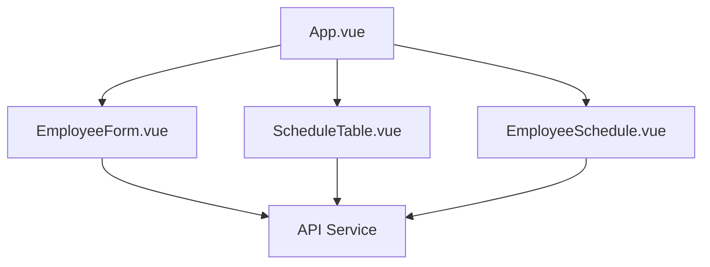
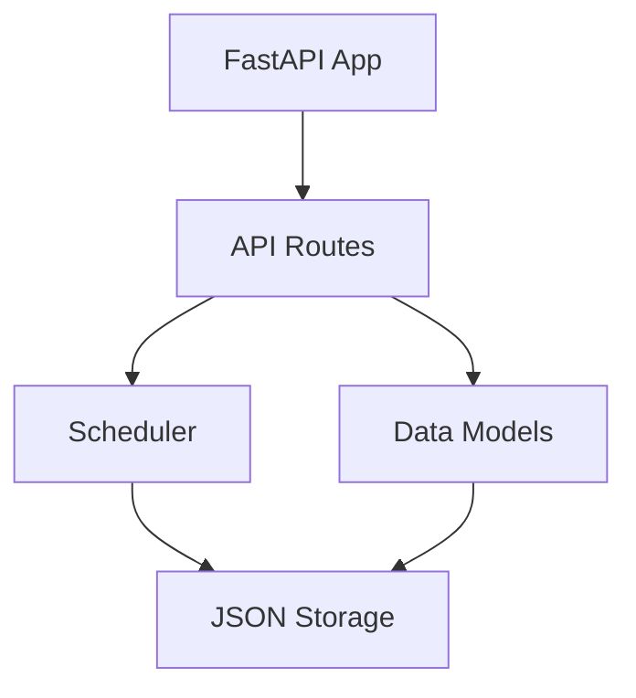

# System Patterns

## Architecture Overview

### Frontend Architecture

### Backend Architecture

## Key Technical Decisions

### 1. Data Storage
- Current: JSON file-based storage
- Future: Upgrade path to SQLite/PostgreSQL
- Rationale: Simple to implement, easy to migrate

### 2. API Design
- RESTful endpoints
- JSON data format
- Stateless communication
- Error handling with status codes
- No authentication required (single manager system)

### 3. Frontend Structure
- Vue.js components
- TailwindCSS for styling
- Axios for API communication
- Reactive data management
- Single manager interface

### 4. Scheduling Logic
- Week-based availability tracking
- Room assignment rules
- Intern-senior pairing algorithm
- Conflict resolution system

## Design Patterns

### 1. Component Patterns
- Single Responsibility Principle
- Composition over inheritance
- Props down, events up
- Computed properties for derived state

### 2. Data Flow
- Unidirectional data flow
- Centralized state management
- API service layer
- Error boundary handling

### 3. Scheduling Patterns
- Rule-based assignment
- Availability checking
- Conflict detection
- Schedule optimization

## Component Relationships

### Frontend Components
1. `App.vue`
   - Main application container
   - Navigation and layout
   - State management
   - Single manager interface

2. `EmployeeForm.vue`
   - Employee data input
   - Validation
   - API integration
   - Manager-only controls

3. `ScheduleTable.vue`
   - Schedule display
   - Week navigation
   - Status visualization
   - Manager controls

4. `EmployeeSchedule.vue`
   - Individual schedule view
   - Availability management
   - Assignment display
   - Manager-only editing

### Backend Components
1. `main.py`
   - Application entry point
   - Configuration
   - Middleware setup
   - No auth middleware

2. `api.py`
   - Route definitions
   - Request handling
   - Response formatting
   - Direct access endpoints

3. `scheduler.py`
   - Scheduling logic
   - Rule implementation
   - Conflict resolution

4. `models.py`
   - Data models
   - Validation
   - Type definitions 